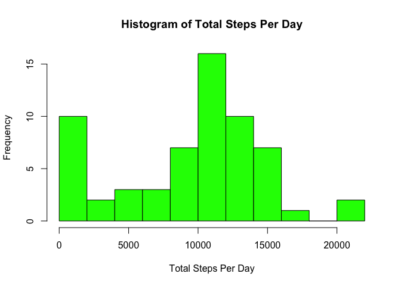
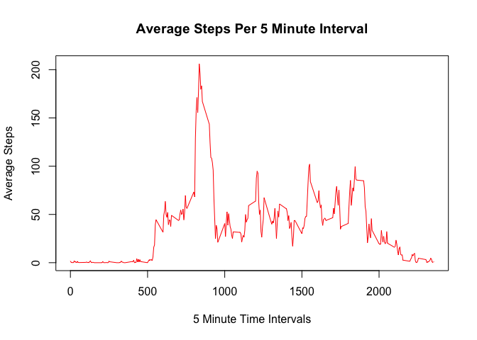
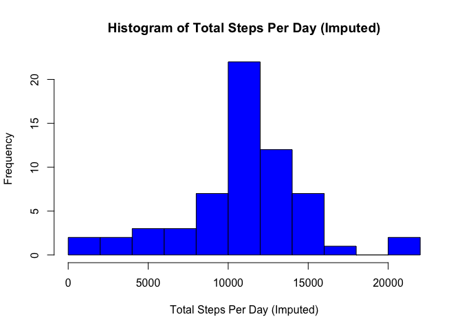
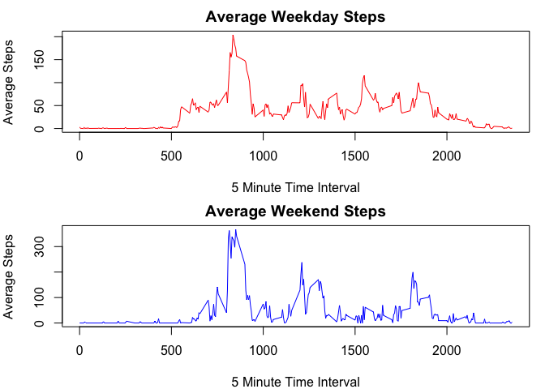

# Coursera
Charles McKay  
1/23/2017  

## Reproducible Research: Week 2 Assignment
### Setup r environment
Load packages


```r
install.packages("timeDate", repos = "http://cran.us.r-project.org")
```

```
## 
## The downloaded binary packages are in
## 	/var/folders/r7/1s64xhzx5515qypdljvtfwdw0000gn/T//RtmpS54A8l/downloaded_packages
```

```r
library(timeDate)
library(plyr)
library(dplyr)
```

```
## 
## Attaching package: 'dplyr'
```

```
## The following objects are masked from 'package:plyr':
## 
##     arrange, count, desc, failwith, id, mutate, rename, summarise,
##     summarize
```

```
## The following objects are masked from 'package:stats':
## 
##     filter, lag
```

```
## The following objects are masked from 'package:base':
## 
##     intersect, setdiff, setequal, union
```

```r
library(data.table)
```

```
## -------------------------------------------------------------------------
```

```
## data.table + dplyr code now lives in dtplyr.
## Please library(dtplyr)!
```

```
## -------------------------------------------------------------------------
```

```
## 
## Attaching package: 'data.table'
```

```
## The following objects are masked from 'package:dplyr':
## 
##     between, first, last
```

### Load and preprocess the data
* Read in file
* Add "time" column with converted "interval" column values to time format
* Add "day" column to dipllay week day based on date column values
* Add "wday" logical column TRUE FALSE for is day a weekend on not


```r
step_data <- read.csv("activity.csv")
step_data$day <- weekdays(as.Date(step_data$date))
step_data$subset_key <- paste(step_data$day, step_data$interval, sep="_")
```

## Assigment Questions
### What is mean total number of steps taken per day?
Calculate total steps per day and mean and median steps per day

```r
steps_day <- group_by(step_data, date)
steps_sum <- summarize(steps_day, day_sum = sum(steps, na.rm = TRUE))
steps_sum_mean <- mean(steps_sum$day_sum)
steps_sum_median <- median(steps_sum$day_sum)
```
Display histogram of total steps per day

```r
hist(steps_sum$day_sum, breaks = 10, col = "green", 
     main="Histogram of Total Steps Per Day", xlab = "Total Steps Per Day")
```

<!-- -->

Mean and median of the total number of steps taken per day

```r
## Mean steps per day
steps_sum_mean
```

```
## [1] 9354.23
```

```r
## Median steps per day
steps_sum_median
```

```
## [1] 10395
```
### What is the average daily activity pattern?  

```r
steps_interval <- group_by(step_data, interval)
steps_by_interval <- summarize(steps_interval, interval_mean = mean(steps, na.rm = TRUE))
plot(steps_by_interval$interval, steps_by_interval$interval_mean, main="Average Steps Per 5 Minute Interval",
     xlab="5 Minute Time Intervals", ylab="Average Steps", col = "red", type = "l")
```

<!-- -->

Maximum average steps steps occur at time interval:

```r
step_interval_max <- steps_by_interval[which.max(steps_by_interval$interval_mean),]
step_interval_max$interval
```

```
## [1] 835
```

### Imputing missing values
* Total number of rows with NAs

```r
sum(is.na(step_data$steps))
```

```
## [1] 2304
```
* Create subset DF for NA rows
* Create subset DF excluding NA rows
* Calculate imputed value as average steps per day/interval combination
* Substitute imputed value for NAs based on day/interval key
* Combine xNA and NA imputed data file to create new DF

```r
## Create subset DF for NA rows
step_data_NA <- step_data[is.na(step_data$steps),]
## Create subset DF excluding NA rows
step_data_xNA <- step_data[!is.na(step_data$steps),]
## Calculate imputed value as average steps per day/interval combination
step_impute <- group_by(step_data_xNA, subset_key)
step_impute_mean <- summarize(step_impute, impute_val = mean(steps, na.rm = TRUE))
## Substitute imputed value for NAs based on day/interval key
new_step_data <- merge(step_data_NA[,c("date", "interval" , "day", 
                                       "subset_key")], step_impute_mean, by= "subset_key")
## Combine xNA and NA imputed data file to create new DF
colnames(new_step_data)[5] <- "steps"
new_step_data <- new_step_data[c(5,2,3,4,1)]
new_step_data <- rbind(new_step_data, step_data_xNA)
```
* Make a histogram of the total number of steps taken each day and
calculate and report the mean and median total number of steps taken per day

```r
new_steps_day <- group_by(new_step_data, date)
new_steps_sum <- summarize(new_steps_day, new_day_sum = sum(steps))
new_steps_sum_mean <- mean(new_steps_sum$new_day_sum)
new_steps_sum_median <- median(new_steps_sum$new_day_sum)
```
* Histogram of total steps taken per day

```r
hist(new_steps_sum$new_day_sum, breaks = 10, col = "blue", 
     main="Histogram of Total Steps Per Day (Imputed)", xlab = "Total Steps Per Day (Imputed)")
```

<!-- -->

* Mean and median total number of steps taken per day

```r
## Mean steps per day
new_steps_sum_mean
```

```
## [1] 10873.55
```

```r
## Median steps per day
new_steps_sum_median
```

```
## [1] 11015
```
* Differences with the estimates from the first part of the assignment: 
After adding imputed values mean and median increased

```r
## Mean steps per day difference
new_steps_sum_mean - steps_sum_mean
```

```
## [1] 1519.317
```

```r
## Median steps per day difference
new_steps_sum_median - steps_sum_median
```

```
## [1] 620
```
### Are there differences in activity patterns between weekdays and weekends?
* Add weekday/weekend factor

```r
new_step_data$wday = ifelse(new_step_data$day %in% c("Saturday", "Sunday"), "weekend", "weekday")
new_step_data$wday <- as.factor(new_step_data$wday)
```
* Create panel plot to compare weekday avtivity vs. weekend activity

```r
par(mfrow = c(2, 1), mar = c(4, 4, 2, 1))
## weekday plot
new_step_data_week <- filter(new_step_data, wday == "weekday")
new_steps_interval_week <- group_by(new_step_data_week, interval)
new_steps_by_interval_week <- summarize(new_steps_interval_week, new_interval_mean_week = mean(steps))
plot(new_steps_by_interval_week$interval, new_steps_by_interval_week$new_interval_mean_week,
     main="Average Weekday Steps", xlab="5 Minute Time Interval", ylab="Average Steps", 
     col = "red", type = "l")
## weekend plot
new_step_data_wend <- filter(new_step_data, wday == "weekend")
new_steps_interval_wend <- group_by(new_step_data_wend, interval)
new_steps_by_interval_wend <- summarize(new_steps_interval_wend, new_interval_mean_wend = mean(steps))
plot(new_steps_by_interval_wend$interval, new_steps_by_interval_wend$new_interval_mean_wend,
     main="Average Weekend Steps", xlab="5 Minute Time Interval", ylab="Average Steps", 
     col = "blue", type = "l")
```

<!-- -->


